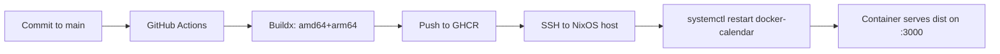

<div align="center">

# Fixed Calendar (IFC)


[](https://github.com/sahajjain01/fixed-calendar/actions/workflows/build-push-deploy.yml)
[](https://github.com/sahajjain01/fixed-calendar/commits/main)

<!-- Demo badge: update link if you host it -->
[](https://calendar.sahajjain.com)

Interactive visual of the 13×28 International Fixed Calendar (with Sol and Year Day) — small, fast, and deployable anywhere via Docker. Built with Bun, served via a tiny Node HTTP server.

</div>

---

## Highlights

- Lightning-fast static build with Bun
- Auto-scrolls to “today” on load
- Simple year jumping and “Go to Today”
- Zero-framework backend (just Node `http`)
- Multi-arch Docker image (amd64 + arm64)

## Tech Stack

- Bun 1.x (build + scripts)
- AngularJS 1.6 + Bootstrap 4
- Docker + GHCR (container registry)
- GitHub Actions (CI/CD)
- NixOS host (runtime target only — no deploy-rs)

## Run Locally (Bun)

- Dev: `bun run dev` – serves from repo root at `http://localhost:3000`.
- Build: `bun run build` – outputs a production bundle to `dist/`.
- Prod: `bun run prod` – builds then serves from `dist/`.

Server supports `--root <dir>` or `STATIC_ROOT=<dir>` to choose the directory to serve.

## Docker

Build locally:

```sh
docker build -t ghcr.io/SahajJain01/fixed-calendar:dev .
docker run --rm -p 3000:3000 ghcr.io/SahajJain01/fixed-calendar:dev
```

Multi-arch build in CI (already configured): `linux/amd64, linux/arm64`.

## CI/CD (GitHub Actions → GHCR → NixOS)

- On push to `main`, CI builds and pushes a multi-arch image to GHCR.
- CI then SSHes to your NixOS host and restarts a systemd service: `docker-calendar`.
- If your service uses `:latest`, ensure the host pulls before restart (sample below).

Workflow file: `.github/workflows/build-push-deploy.yml`

Required repository secrets:

- `NIX_SSH_HOST`: server hostname/IP
- `NIX_SSH_USER`: SSH user used for deployment
- `NIX_SSH_KEY`: private key for that user (PEM content, no passphrase)

## NixOS: systemd service (example)

To always run the latest pushed image, include a pull in your unit or pre-start script:

```ini
[Unit]
Description=Fixed Calendar (Docker)
After=network-online.target docker.service
Wants=network-online.target

[Service]
Restart=always
Environment=IMAGE=ghcr.io/<owner>/<repo>:latest
ExecStartPre=/usr/bin/docker login ghcr.io -u <gh-username> -p <ghcr-token>
ExecStartPre=/usr/bin/docker pull %E{IMAGE}
ExecStart=/usr/bin/docker run --rm \
  --name docker-calendar \
  -p 3000:3000 \
  %E{IMAGE}
ExecStop=/usr/bin/docker stop docker-calendar

[Install]
WantedBy=multi-user.target
```

Then enable and start:

```sh
sudo systemctl daemon-reload
sudo systemctl enable --now docker-calendar
```

Tip: You can skip `docker login` if your image is public.

## Project Structure

```
.
├─ index.html            # Markup and layout
├─ app.js                # AngularJS controller and logic
├─ assets/               # Styles, icons, AngularJS lib
├─ server.js             # Minimal static server (Node http)
├─ scripts/
│  ├─ build.mjs         # Bun build + asset copy to dist/
│  └─ prod.mjs          # Build then serve dist/
├─ Dockerfile            # Multi-arch container build (Bun base)
└─ .github/workflows/
   └─ build-push-deploy.yml # CI build/push + remote restart
```

## How It Works (Mermaid)



## Notes

- This project does not use deploy-rs anymore; deployment is simple SSH + systemd restart.
- If you don’t see your latest HTML changes in prod, make sure the host pulls the new image before restart, or pin a unique tag per deploy (e.g., the commit SHA).

## License

MIT (or your preferred license)

